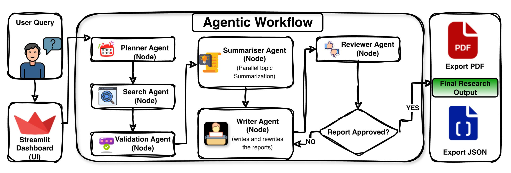

# DESIGN.md

# Multi-Agent Research Assistant

## 1. Project Overview

### Objective

The objective of this project was to build a Multi-Agent Research Assistant capable of performing complex research tasks through collaboration between specialized AI agents.

Traditional single-prompt Large Language Model (LLM) systems often struggle with multi-step research tasks because they attempt to perform planning, information gathering, validation, analysis, synthesis, and reporting within a single interaction. This frequently results in incomplete coverage, hallucinations, weak reasoning, and poor report structure.

To address these limitations, this project decomposes the research process into a sequence of specialized agents orchestrated using LangGraph. Each agent performs a focused responsibility and passes structured outputs to the next stage in the workflow.

The system transforms a user query into a comprehensive research report through the following stages:

1. Research Planning
2. Web Search
3. Search Result Validation
4. Topic Summarization
5. Report Writing
6. Quality Review
7. Automated Report Revision

The final result is a research workflow that is more modular, maintainable, explainable, and scalable than a traditional single-prompt approach.

---

# 2. System Architecture

## High-Level Workflow

```text
User Query
    ↓
Planner Agent
    ↓
Search Agent
    ↓
Validation Agent
    ↓
Parallel Summariser Agent
    ↓
Writer Agent
    ↓
Reviewer Agent
    ↓
Approved?

YES → Final Report

NO → Rewrite Loop → Writer Agent → Reviewer Agent
```

Architecture Diagram:



---

# 3. Architectural Decisions

## Why a Multi-Agent Architecture?

A single LLM prompt has several limitations:

* Limited context management
* Poor task decomposition
* Weak verification capabilities
* Difficulty maintaining structure
* Increased hallucination risk

To overcome these challenges, the workflow was divided into specialized agents.

Each agent has:

* A dedicated responsibility
* A clearly defined prompt
* Structured inputs
* Structured outputs

This separation improves reliability and makes the workflow easier to debug and extend.

---

## Why LangGraph?

LangGraph was selected as the orchestration framework because it provides:

### Explicit Workflow Control

The workflow can be modeled as a graph of nodes and transitions.

### Shared State Management

All agents operate on a common state object, making data flow transparent and predictable.

### Conditional Routing

The reviewer can determine whether execution should continue to the final output or return to the writer for revisions.

### Iterative Workflows

LangGraph supports loops, enabling automatic report improvement based on reviewer feedback.

---

# 4. Agent Design

## Planner Agent

### Purpose

The Planner Agent converts a broad user query into focused research topics.

### Input

User query.

Example:

```text
What is the impact of AI on software engineering?
```

### Output

Research goal and subtopics.

Example:

```text
Current AI tools
Developer productivity
Code generation
Testing automation
Industry adoption
Future impact
```

### Design Rationale

Search engines perform better with focused queries than broad research questions.

The planner creates search-friendly topics that guide downstream agents.

---

## Search Agent

### Purpose

The Search Agent retrieves information from the web.

### Technology

DuckDuckGo Search

### Responsibilities

* Perform web searches
* Collect search results
* Extract snippets
* Gather sources

### Design Decisions

The search layer was separated from report generation to improve factual grounding.

Each research topic is searched independently to improve coverage.

### Domain Filtering

Low-quality domains are filtered.

Examples:

```text
youtube.com
instagram.com
facebook.com
quora.com
pinterest.com
```

Priority is given to more reliable sources whenever possible.

---

## Validation Agent

### Purpose

The Validation Agent filters irrelevant or low-quality search results.

### Initial Design

Originally the validation process used an LLM for every search result.

Workflow:

```text
Search Result
    ↓
LLM Validation
    ↓
Accept / Reject
```

### Problem

This significantly increased execution time because dozens of LLM calls were required for every report.

### Final Design

The system was redesigned to use rule-based validation.

Validation checks:

* Empty content
* Keyword overlap
* Relevance score
* Content length
* Source quality

### Benefits

* Lower latency
* Reduced API cost
* Improved scalability

---

## Summariser Agent

### Purpose

Transform validated search results into topic-level summaries.

### Input

Validated search results grouped by topic.

### Output

One structured summary per topic.

### Design Decision

Each topic is summarized independently.

Example:

```text
Topic 1 → Summary
Topic 2 → Summary
Topic 3 → Summary
```

### Parallel Execution

Summaries are generated concurrently using parallel execution.

Benefits:

* Reduced execution time
* Better resource utilization
* Improved user experience

This optimization significantly reduced overall workflow latency.

---

## Writer Agent

### Purpose

Generate the final research report.

### Responsibilities

* Create title
* Generate executive summary
* Write report body
* Organize sections
* Compile references

### Design Principles

The writer does not perform research.

Instead, it synthesizes information collected by previous agents.

This separation reduces hallucinations and improves traceability.

---

## Reviewer Agent

### Purpose

Evaluate report quality.

### Evaluation Criteria

* Completeness
* Accuracy
* Depth
* Structure
* Clarity
* References

### Output

* Numerical score
* Approval status
* Improvement feedback

### Design Decision

The reviewer evaluates reports against the planned scope rather than introducing entirely new requirements.

This prevents unrealistic revision requests.

---

# 5. Rewrite Loop

One of the most important features of the system is the automated rewrite loop.

## Workflow

```text
Writer
   ↓
Reviewer
   ↓
Rejected?
   ↓
Feedback
   ↓
Writer
```

### Why Not Re-Search?

A rejected report usually suffers from:

* Weak structure
* Insufficient analysis
* Poor synthesis

These issues can often be corrected using existing research.

Repeating:

* Search
* Validation
* Summarization

would dramatically increase latency without adding significant value.

Therefore only the writer is re-executed.

### Benefits

* Faster execution
* Lower API costs
* More efficient revisions

---

# 6. Structured Outputs

The system uses Pydantic schemas to enforce structured communication between agents.

Examples include:

* ResearchPlanner
* SearchResult
* ValidatedSearchResult
* TopicSummary
* ResearchReport
* ReportReview

Benefits:

### Reliability

Agents receive predictable inputs.

### Validation

Schema enforcement reduces runtime errors.

### Maintainability

Changes can be managed through centralized models.

### Explainability

Data flow remains transparent throughout the workflow.

---

# 7. Streamlit Dashboard Design

A Streamlit interface was developed to provide an interactive user experience.

## Features

### Query Submission

Users can submit research questions through a simple interface.

### Workflow Monitoring

Displays:

* Active node execution
* Processing status
* Runtime information

### Report Viewer

Displays:

* Title
* Executive Summary
* Full Report
* References

### Quality Review Panel

Displays:

* Review score
* Approval status
* Reviewer feedback

### Export Features

Supports:

* PDF Export
* JSON Export

### Execution Timeline

Provides visibility into workflow execution and performance.

---

# 8. Performance Optimizations

Several optimizations were introduced during development.

## Rule-Based Validation

Replaced expensive LLM-based validation.

Result:

* Reduced API usage
* Improved response time

---

## Parallel Summarization

Topic summaries are generated concurrently.

Result:

* Faster report generation
* Improved scalability

---

## Search Optimization

Planner-generated topics were simplified to improve search quality and reduce timeouts.

---

## Rewrite Reuse

Revisions reuse existing summaries rather than repeating the entire workflow.

Result:

* Lower latency
* Reduced cost

---

# 9. Challenges Encountered

## Search Quality

Some searches returned irrelevant or low-quality sources.

Solution:

* Domain filtering
* Rule-based validation

---

## Slow Validation

Initial LLM-based validation introduced significant delays.

Solution:

* Replace with rule-based validation

---

## Reviewer Strictness

The reviewer sometimes requested information outside the research scope.

Solution:

* Restrict review evaluation to the planned topics

---

## Long Search Queries

Complex planner-generated topics occasionally caused search failures.

Solution:

* Generate concise search-oriented subtopics

---

# 10. Future Improvements

Several enhancements could further improve the system.

### Multi-Search Integration

Combine:

* DuckDuckGo
* Google Search APIs
* Academic databases

### Citation Generation

Automatically generate formal citations.

### Source Credibility Scoring

Rank sources by reliability.

### Human-in-the-Loop Review

Allow manual approval and editing.

### Vector Database Memory

Store previous research results for reuse.

### Dynamic Re-Search

Allow the reviewer to trigger additional research when important information is missing.

### Agent Analytics

Track:

* Execution times
* Success rates
* Quality metrics

---

# 11. Conclusion

This project demonstrates how complex research tasks can be decomposed into a coordinated workflow of specialized AI agents.

By combining planning, search, validation, summarization, report generation, review, and iterative improvement, the system delivers more reliable and structured research outputs than traditional single-prompt approaches.

The architecture is modular, scalable, and extensible, making it a strong foundation for future research-oriented AI systems.
